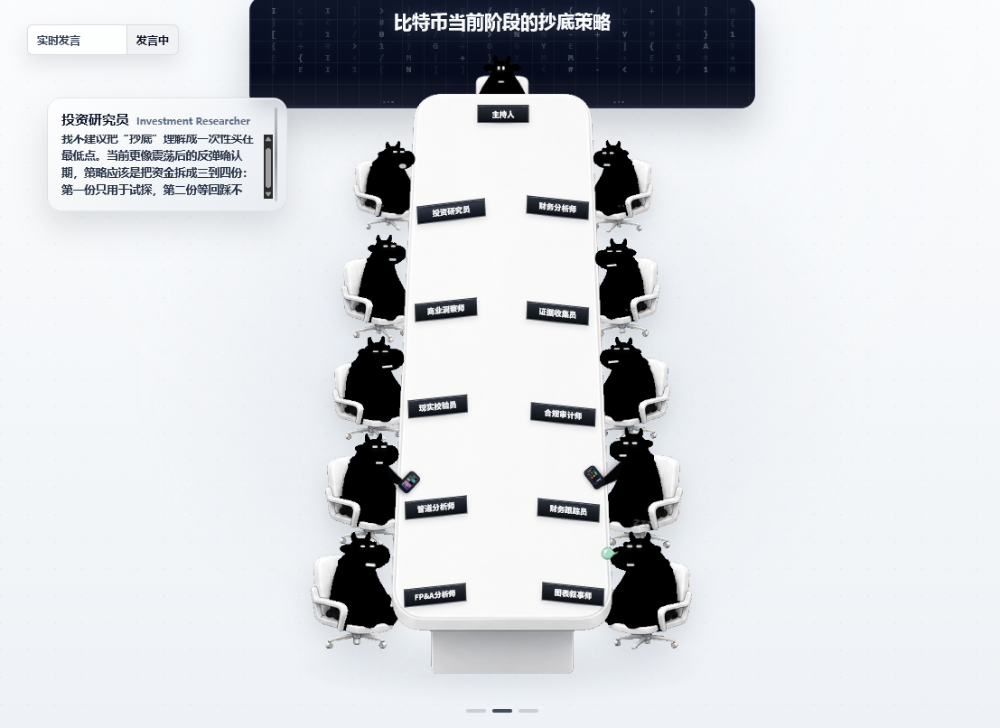
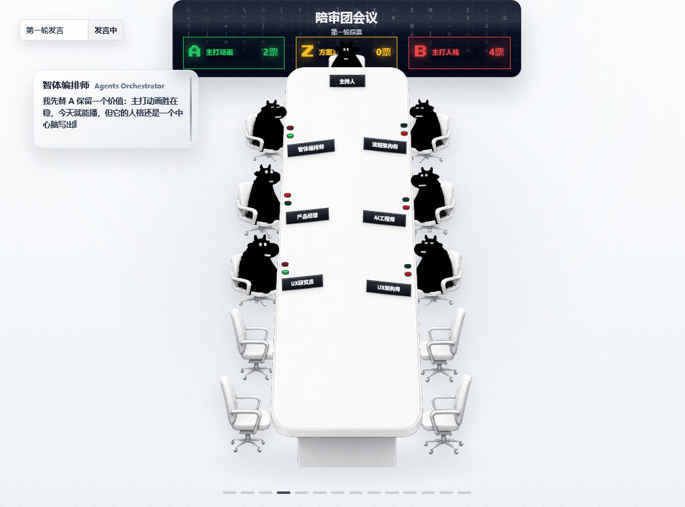
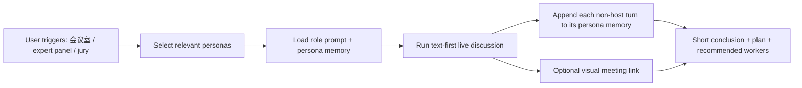

<p align="center">
  
</p>

<h1 align="center">Meeting Room for Codex</h1>

<p align="center">
  <b>260 independent expert personas for Codex meetings.</b><br>
  Text-first multi-persona discussion, persistent per-persona memory, and an optional visual meeting room.
</p>

<p align="center">
  
  
  
  
</p>

---

## What Makes It Different

Meeting Room is not a scripted roleplay transcript. It is a Codex skill that runs a structured expert meeting with stable specialist personas.

<table>
  <tr>
    <td width="33%">
      <h3>260 Personas</h3>
      <p>Finance, engineering, product, design, testing, compliance, marketing, support, game development, XR, and more.</p>
    </td>
    <td width="33%">
      <h3>Independent Memory</h3>
      <p>Every persona owns a separate <code>profile.md</code>, <code>knowledge.md</code>, <code>memory.md</code>, and <code>memory_summary.md</code>.</p>
    </td>
    <td width="33%">
      <h3>Real Discussion</h3>
      <p>Participants react to the live meeting context instead of following a fixed script or a fake agree/disagree order.</p>
    </td>
  </tr>
  <tr>
    <td width="33%">
      <h3>Memory After Speaking</h3>
      <p>Every live non-host turn is appended back into that speaker's own persona memory by default.</p>
    </td>
    <td width="33%">
      <h3>Text First</h3>
      <p>The useful meeting happens in Codex chat. The viewer is a manual sidecar for optional visual playback.</p>
    </td>
    <td width="33%">
      <h3>Jury Deliberation</h3>
      <p>For hard choices, the room can run A/B options, visible votes, minority arguments, persuasion rounds, and convergence.</p>
    </td>
  </tr>
</table>

## Two Meeting Styles

### Normal Meeting

Use a normal meeting when you want strategy, review, planning, research, product direction, architecture tradeoffs, launch checks, or risk analysis.

<p align="center">
  
</p>

### Jury Meeting

Use a jury meeting when the decision needs conflict: A/B plans, visible vote counts, persuasion, minority pressure, and final acceptance.

<p align="center">
  
</p>

## How It Works



## The Memory Model

Each role keeps its own small memory store:

```text
references/personas/<division>/<role-slug>/
├── profile.md
├── knowledge.md
├── memory.md
└── memory_summary.md
```

This means the investment researcher can remember investment-style judgments, the UX researcher can remember user-experience concerns, and the compliance auditor can remember risk boundaries without all of them collapsing into one shared global memory blob.

## Trigger Examples

```text
会议室，讨论一下这个产品发布策略
专家团开会，看看这个架构有没有风险
开个会，帮我评审这个 README
陪审团会议，A 方案和 B 方案投票审议
12怒汉模式，直到大家接受同一个执行方案
```

## Repository Map

| Path | Purpose |
| :--- | :--- |
| `SKILL.md` | Main Codex skill contract |
| `references/roles/` | Source role prompts for the 260 personas |
| `references/personas/` | Per-persona profile, knowledge, memory, and summary |
| `runtime/` | Live meeting runtime, import, append, and memory-write scripts |
| `scripts/` | Launch, context building, compaction, and regression checks |
| `assets/expert-meeting-viewer/` | Optional visual meeting room |
| `docs/images/` | README screenshots |

## Design Principles

- **No fake panel scripts**: the meeting should not be prewritten theater.
- **No forced consensus**: disagreement is allowed until the plan is actually actionable.
- **No viewer dependency**: the text meeting must be useful even if the user never opens the visual room.
- **No shared memory soup**: personas remember through their own files, not one global note.
- **No hidden external action**: recommended workers do not execute unless the user explicitly chooses execution.

## Safety Note

Meeting Room can help reason about finance, compliance, medical-adjacent workflows, automation, and other high-risk domains, but it is not a licensed advisor. Use it to structure assumptions, risk boundaries, evidence needs, and next-step validation rather than as blind professional advice.

---

<p align="center">
  <b>Meeting Room turns Codex from one voice into a room of specialists.</b><br>
  Independent personas. Independent memory. One actionable conclusion.
</p>
