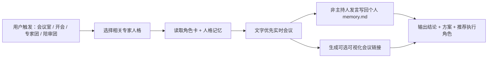

<p align="center">
  
</p>

<h1 align="center">会议室 Meeting Room for Codex</h1>

<p align="center">
  <b>让 Codex 变成一间真正会开会的专家会议室。</b><br>
  260 个独立人格、独立记忆、独立发言，文字会议优先，可视化会议可选旁观。
</p>

<p align="center">
  
  
  
  
</p>

---

## 这是什么

`meeting-room` 是一个 Codex Skill。它不是普通的“角色扮演聊天”，而是一套多专家会议机制：

- 根据问题自动选择合适的专家人格。
- 每个人格读取自己的角色卡、专业资料和长期记忆。
- 会议过程中实时发言、互相回应、提出异议、修正判断。
- 每个非主持人的发言都会默认写回自己的人格记忆。
- 最后输出短结论、实施方案和推荐执行角色。
- 可视化会议只作为旁观窗口，真正有用的是文字版会议实录和结论。

## 核心卖点

<table>
  <tr>
    <td width="33%">
      <h3>260 个专家人格</h3>
      <p>覆盖产品、工程、设计、测试、金融、合规、营销、销售、客服、游戏、XR 等方向。</p>
    </td>
    <td width="33%">
      <h3>独立思考</h3>
      <p>每个人格都有稳定角色边界，不会全部变成同一个“聪明旁白”。</p>
    </td>
    <td width="33%">
      <h3>独立记忆</h3>
      <p>每个人格都有自己的 <code>profile.md</code>、<code>knowledge.md</code>、<code>memory.md</code> 和 <code>memory_summary.md</code>。</p>
    </td>
  </tr>
  <tr>
    <td width="33%">
      <h3>发言写回记忆</h3>
      <p>实时会议中，非主持人每次发言都会写回该人格自己的 <code>memory.md</code>，下次还能延续判断。</p>
    </td>
    <td width="33%">
      <h3>文字优先</h3>
      <p>默认先在 Codex 聊天里给出完整文字会议，可视化会议只给链接，用户想看再点。</p>
    </td>
    <td width="33%">
      <h3>陪审团模式</h3>
      <p>需要 A/B 决策时，可以进入陪审团审议：多轮投票、少数派说服、直到形成可执行共识。</p>
    </td>
  </tr>
</table>

## 两种会议效果

### 普通会议

适合策略讨论、产品评审、架构取舍、风险分析、研究规划、发布前 Review。普通会议不会强行投票，也不会让每个人按固定模板发言，而是让专家根据上下文自然接话。

<p align="center">
  
</p>

### 陪审团会议

适合方案 PK、12 怒汉式审议、A/B 决策、多轮投票、少数派反驳和最终共识。它不是“多数票赢”，而是让不同立场互相说服，直到形成大家都能接受的执行方案。

<p align="center">
  
</p>

## 工作流



## 人格记忆结构

每个角色都有自己的小型资料库，不共享一个混乱的大记忆：

```text
references/personas/<分组>/<角色-slug>/
├── profile.md          # 稳定身份与职责边界
├── knowledge.md        # 长期专业知识
├── memory.md           # 近期会议和任务记忆
└── memory_summary.md   # 压缩后的长期记忆摘要
```

这意味着：投资研究员会保留投资视角的判断，UX 研究员会保留用户体验视角的判断，合规审计师会保留风险边界视角的判断。它们不会混成一个全局大脑。

## 触发示例

```text
会议室，讨论一下这个产品发布策略
专家团开会，看看这个架构有没有风险
开个会，帮我评审这个 README
陪审团会议，A 方案和 B 方案投票审议
12怒汉模式，直到大家接受同一个执行方案
```

## 仓库结构

| 路径 | 说明 |
| :--- | :--- |
| `SKILL.md` | Codex Skill 主规则与会议协议 |
| `references/roles/` | 260 个专家人格的源角色卡 |
| `references/personas/` | 每个人格自己的资料、知识、记忆与摘要 |
| `runtime/` | 实时会议、导入会议、追加发言、写入人格记忆的脚本 |
| `scripts/` | 启动会议、构建上下文、压缩记忆、合同测试 |
| `assets/expert-meeting-viewer/` | 可选的可视化会议室 |
| `docs/images/` | README 展示图 |

## 设计原则

- **不要假剧本**：会议不是预写台词，而是根据问题和上下文实时讨论。
- **不要人格串味**：每个专家必须从自己的专业边界说话。
- **不要强行共识**：有分歧就保留分歧，直到能落到行动。
- **不要依赖动画**：可视化只是旁观，文字会议才是核心交付物。
- **不要全局记忆糊成一团**：每个人格有自己的记忆文件。
- **不要假执行**：推荐员工不等于已经执行，只有用户确认后才进入执行阶段。

## 风险提示

会议室可以讨论金融、合规、医疗边界、自动化、增长等高风险问题，但它不是持牌顾问。它适合用来整理假设、证据、风险边界、执行方案和验证路径，不应该被当成盲目决策依据。

---

<p align="center">
  <b>会议室让 Codex 不再只是一个声音，而是一间有记忆、有分歧、有专业边界的专家会议室。</b><br>
  260 个独立人格，各自思考，各自记住，最后一起收束成可执行结论。
</p>
